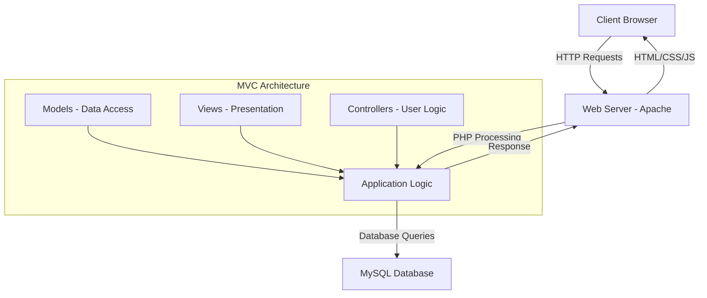
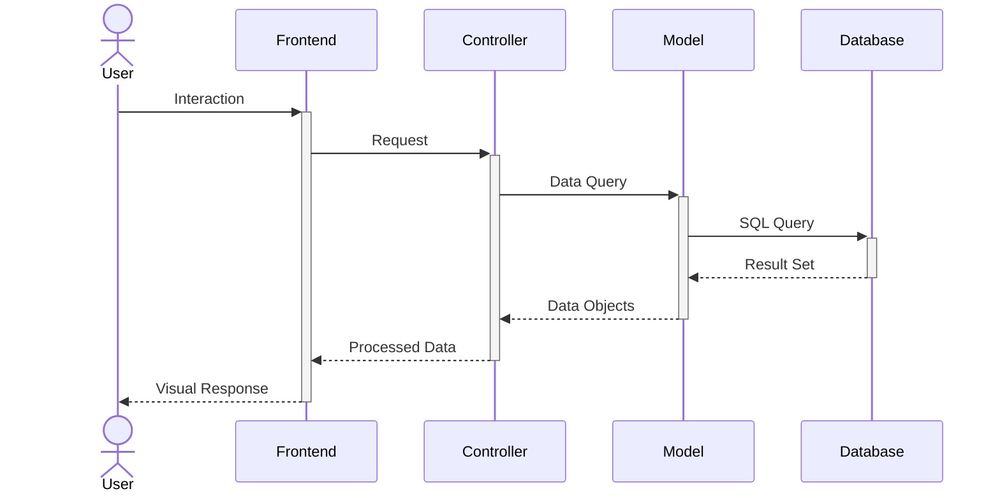
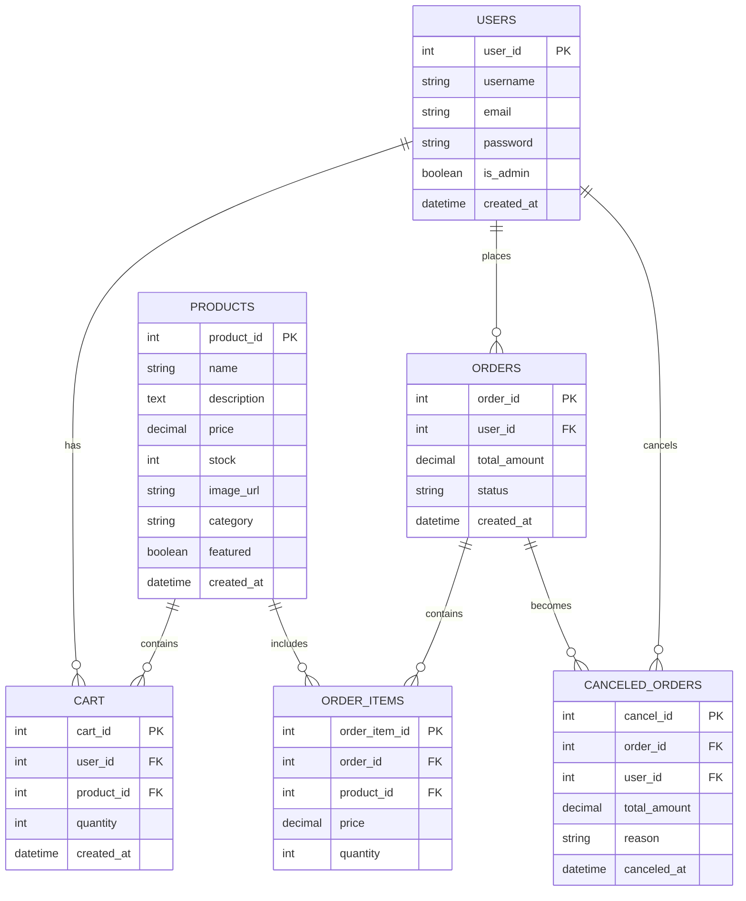
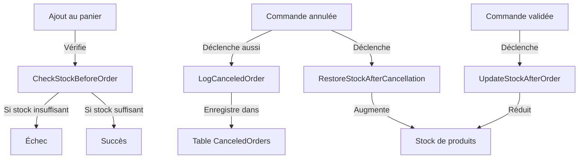
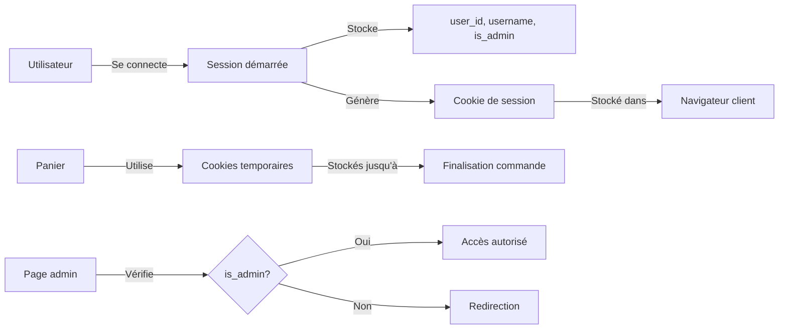

# Rapport sur le Projet d'une Boutique en Ligne - Nova Gaming

## Introduction

Ce document présente la conception et la mise en œuvre de "Nova Gaming", une boutique en ligne spécialisée dans la vente d'équipements et d'accessoires de gaming. Ce projet a été développé dans le cadre des modules Web et Bases de Données, en appliquant les principes de conception web responsive et les bonnes pratiques de gestion de données.

## Architecture du Système

### Architecture Web

- **Technologies utilisées** : PHP, HTML5, CSS3, JavaScript
- **Serveur** : Apache via Laragon pour le développement local
- **Structure MVC simplifiée** : Séparation des aspects de présentation, traitement et données



### Flux des Requêtes



## Schéma Relationnel de la Base de Données

La base de données "Nova" comporte les tables suivantes avec leurs relations :



## Fonctionnalités Principales

### Interface Utilisateur

- Page d'accueil présentant les produits en vedette
- Catalogue de produits avec filtres (catégorie, prix)
- Détails du produit avec description complète
- Système de panier d'achat
- Historique des commandes

### Interface Administrateur

- Tableau de bord avec statistiques
- Gestion des produits (ajout, modification, suppression)
- Gestion des commandes
- Gestion des utilisateurs

## Procédures Stockées et Triggers

### Procédures Stockées

1. **GetOrderDetails** : Affiche les détails d'une commande et calcule le total
2. **FinalizeOrder** : Valide une commande et vide le panier
3. **GetOrderHistory** : Récupère l'historique des commandes d'un client

### Triggers

1. **before_cart_insert**: Empêche l'ajout au panier si la quantité dépasse le stock
2. **RestoreStockAfterCancellation** : Gére les commandes annuleé



## Implémentation des Sessions et Cookies



## Structure de Projet

```
Nova/
│
├── admin/                  # Admin panel files
│   ├── add_product.php     # Add new product form
│   ├── edit_product.php    # Edit product form
│   ├── index.php           # Admin dashboard
│   ├── manage_orders.php   # Order management
│   ├── manage_products.php # Product management
│   ├── manage_users.php    # User management
│   ├── view_order.php      # Order details
│   └── view_user_orders.php # User order history
│
├── assets/                 # Static assets
│   ├── css/                # Stylesheets
│   │   └── style.css       # Main CSS file
│   ├── images/             # Product and site images
│   └── js/                 # JavaScript files
│       └── script.js       # Main JS file
│
├── database/               # Database files
│   └── install_db.sql      # Database schema and sample data
│
├── includes/               # Shared PHP components
│   ├── currency_format.php # Currency formatting functions
│   ├── db.php              # Database connection
│   ├── footer.php          # Common footer
│   └── header.php          # Common header with navigation
│
├── add_to_cart.php         # Add product to cart functionality
├── cancel_order.php        # Order cancellation functionality
├── cart.php                # Shopping cart page
├── checkout.php            # Checkout process
├── index.php               # Homepage
├── login.php               # User login page
├── logout.php              # Logout functionality
├── order_confirmation.php  # Order confirmation page
├── order_details.php       # Detailed view of an order
├── orders.php              # Order history page
├── product_details.php     # Single product view
├── products.php            # All products listing with filters
├── register.php            # User registration page
└── README.md               # Project documentation
```

## Conclusion

Le projet "Nova Gaming" représente une solution e-commerce complète intégrant les aspects frontend et backend. L'architecture mise en place permet une gestion efficace des produits, des commandes et des utilisateurs, tout en assurant l'intégrité des données via des procédures stockées et des triggers.
